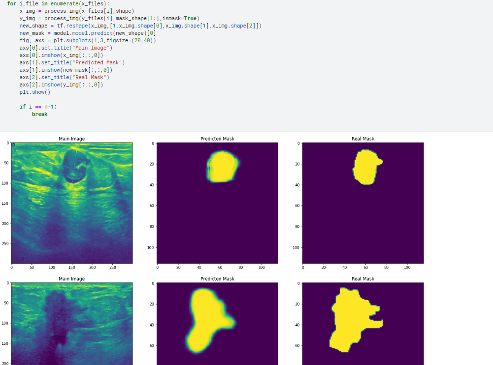
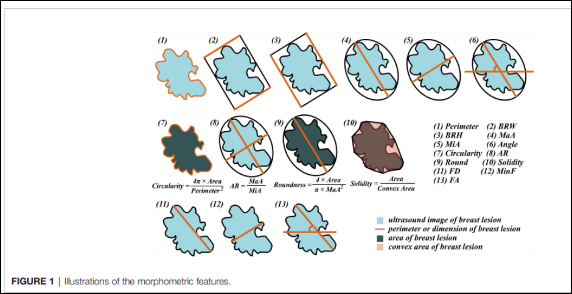
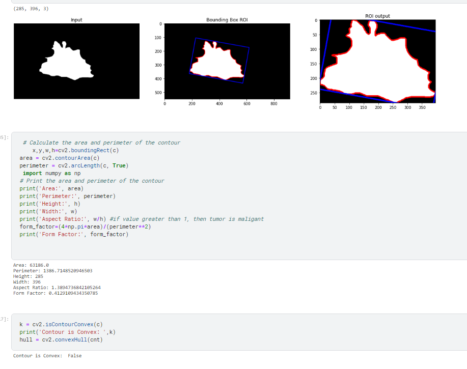
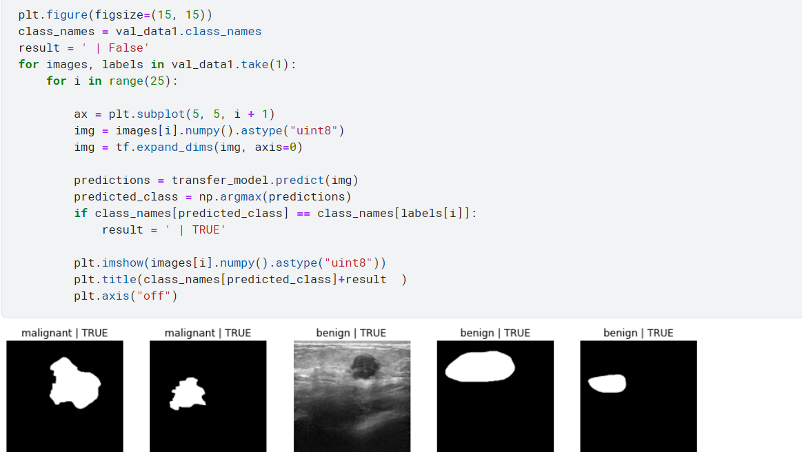
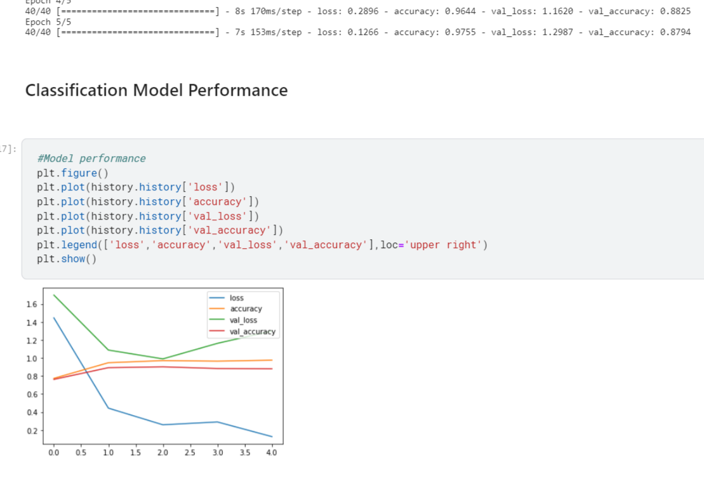

# Ultrasound Image Segmentation and Classification Using Deep Learning

This repository provides a complete pipeline for **ultrasound image segmentation**, **feature extraction**, and **classification** using a combination of **deep learning** and **classical computer vision techniques**.  
The project demonstrates how contour-based segmentation combined with domain-specific shape and intensity features can improve classification performance in medical ultrasound workflows.

---

---

# 1. Project Overview

Ultrasound imaging is widely used in medical diagnostics, yet challenges such as low contrast, speckle noise, and irregular boundaries often make segmentation and classification difficult.

This project implements a **hybrid AI solution** that integrates:

- Preprocessing for noise reduction  
- Contour-based segmentation  
- Extraction of shape, geometric, and texture features  
- Deep learning classification (CNN models)  
- Visualization and performance evaluation  

The combination of **classical image processing + deep learning** leads to interpretable and robust results.

---

# 2. Methodology

## 2.1 Preprocessing Steps
- Image normalization  
- Speckle noise reduction  
- Thresholding methods  
- Morphological operations  
- Region of interest (ROI) isolation  

These steps ensure clean contour detection and reliable feature extraction.

---

## 2.2 Segmentation Pipeline

Contours are extracted using OpenCV techniques:

1. Adaptive thresholding  
2. Canny edge detection  
3. Finding largest connected contour  
4. Mask generation  
5. Segmentation of region of interest  

### Segmented Contours Example

This illustration shows the extracted contour boundaries superimposed over the ultrasound region.

---

# 3. Feature Engineering

A set of **geometric**, **shape-based**, and **morphological** features are computed, including:

- Area  
- Perimeter  
- Major axis length  
- Minor axis length  
- Aspect ratio  
- Equivalent radius  
- Circularity / Roundedness  
- Solidity  
- Intensity-based metrics (mean, variance, etc.)  

### Feature Summary Visualization

### Area, Perimeter, Radius

### Shape Properties (Roundedness, Solidity, Axes)

These features help quantify the lesion/structure's characteristics and improve downstream classifier accuracy.

---

# 4. Deep Learning Classification

A convolutional neural network (CNN) architecture was trained on segmented ultrasound images.  
The model classifies images into predefined categories based on visual and extracted feature patterns.

### Validation and Test Predictions

---

# 5. Results and Evaluation

## 5.1 Model Performance

The training and validation accuracy/loss curves are shown below:

The learning curves indicate stable convergence, demonstrating that the segmentation and feature extraction steps help the classifier generalize effectively.

---

# 6. Technologies Used

- Python  
- TensorFlow / Keras (for classification)  
- OpenCV (for segmentation & feature extraction)  
- NumPy, Pandas  
- Matplotlib, Seaborn  
- Scikit-learn  

---

# 7. Applications

This pipeline can be adapted for:

- Medical ultrasound lesion classification  
- Automated diagnostic support  
- Feature-driven medical AI research  
- Contour-based morphological analysis  
- Hybrid deep learning + CV systems  

---

# 8. Future Work

- Integration of U-Net or transformer-based segmentation  
- Multi-class classification  
- Larger annotated dataset  
- End-to-end training without manual contour extraction  
- Grad-CAM model explainability (XAI)

---

# 9. Author

Developed by **Annas Mustafa**  
AI/ML Engineer | Computer Vision Researcher  

For professional inquiries, reach out via LinkedIn or portfolio website.

---

# 10. License

This project is released under the MIT License.

